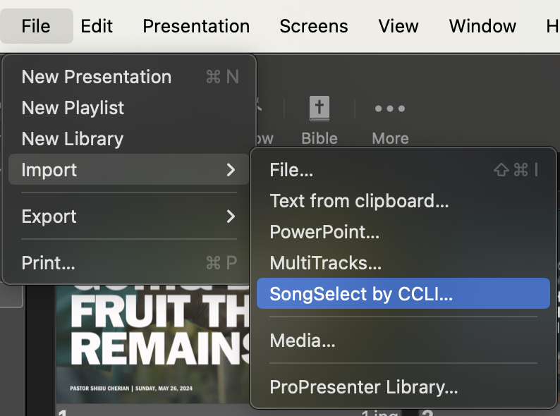
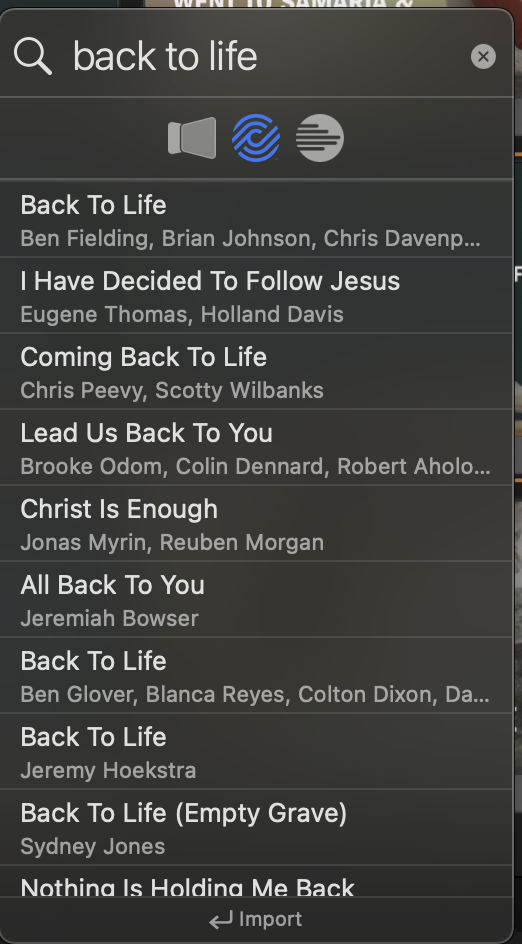
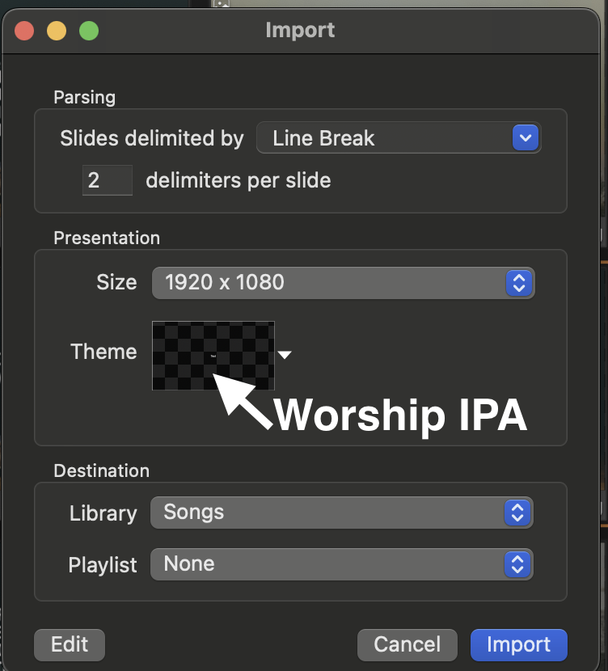
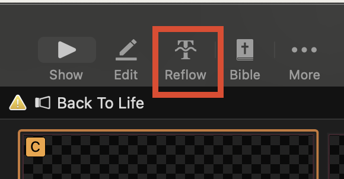
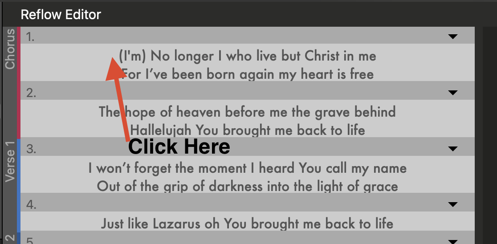
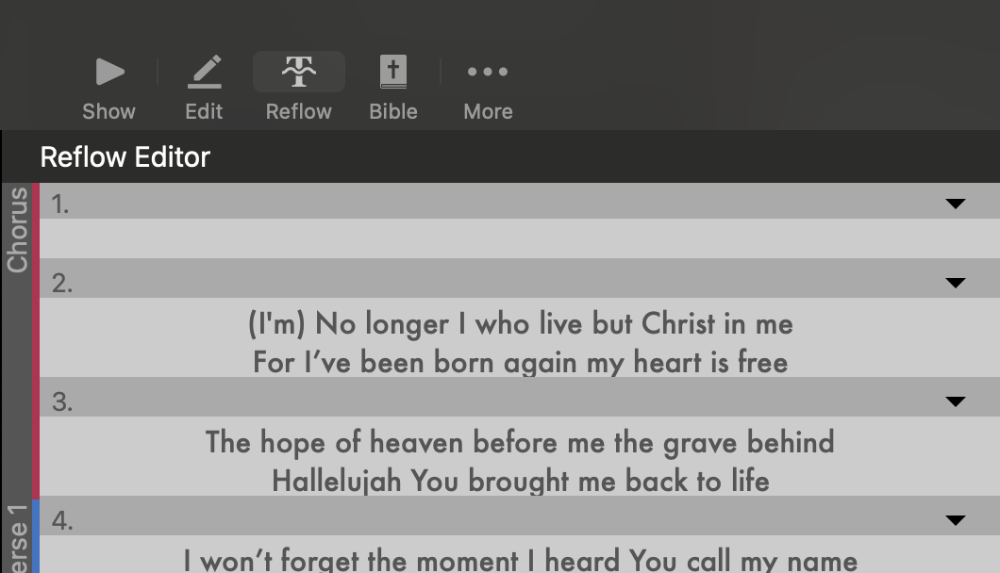
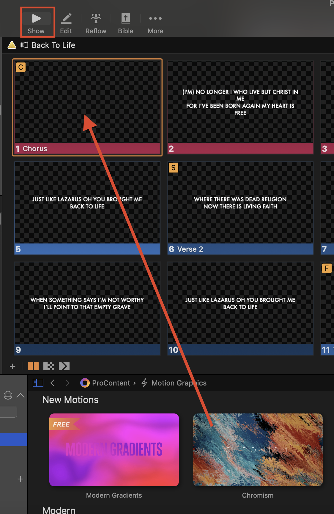

## Adding Songs

- Click on the **SongSelect by CCLI** button in the toolbar or navigate to **File** > **Import** > **SongSelect by CCLI**.
    
- A new window will open for SongSelect by CCLI.
- In the search bar, type the title or a portion of the lyrics of the song you want to import.
    
- Press **Enter** or click the **Search** button.
- Browse through the search results to find the correct song.
- Click on the desired song to preview it.
- If the preview looks correct, click the **Import** button.
    
- Click on Reflow
    
- Click at the beginning of the slide.
        
- Press and Hold **Option** and press **Enter** to make a new slide.
    
- New Slide made
        
- Press Show and drag in the background
    
- The song is now added! 