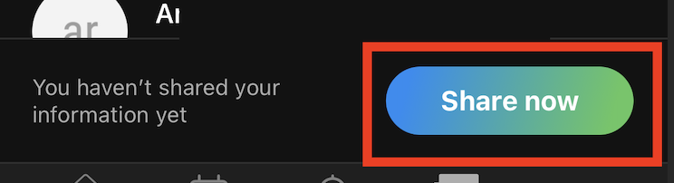

### Church Center App Setup Guide

> Welcome to International Pentecostal Assembly! To stay connected with our church community and access all our resources easily, we encourage you to download and set up the Church Center app. Follow these simple steps to get started:

#### **Step 1: Download the Church Center App**
1. **For iPhone Users:**
   - Open the App Store on your iPhone.
   - Search for “Church Center” in the search bar.
   - Find the app with the Church Center logo (a green and white icon) and tap “Get” or “Download.”
   - Wait for the app to download and install.
   

2. **For Android Users:**
   - Open the Google Play Store on your Android device.
   - Search for “Church Center” in the search bar.
   - Locate the app with the Church Center logo and tap “Install.”
   - Allow the app to download and install.

#### **Step 2: Open the Church Center App**
1. Once installed, open the Church Center app.
2. If prompted, allow the app to access your location. This helps you find International Pentecostal Assembly more easily.

#### **Step 3: Find and Connect to International Pentecostal Assembly**
1. **Search for International Pentecostal Assembly:**
   - On the home screen, tap “Get Started.”
   - You’ll be asked to “Find Your Church.” Enter “International Pentecostal Assembly” in the search bar.
   - You can also enter our zip code “73099” to narrow down the search.
   

2. **Select International Pentecostal Assembly:**
   - When International Pentecostal Assembly appears in the search results, tap on it.
   - Verify the church information to ensure you’re connecting to the correct church.

3. **Confirm Your Church:**
   - Once you’ve selected International Pentecostal Assembly, tap “This is my church” to confirm.

#### **Step 4: Log In**
1. **Log In:**
   - You should already have an account, enter your phone number or email address associated with your profile.
   - You’ll receive a login code via text message or email. Enter this code to log in.
   

#### **Step 5: Explore Church Center Features**
1. **Home:** Featured content and Important Links.
2. **Give:** Easily and securely give tithes and offerings directly through the app or Zelle. 
3. **Events:** Browse and register for upcoming events and gatherings.
4. **Groups:** Join small groups or ministries to connect with others in the church community.
5. **Announcements:** View upcoming events, announcements, and other important information. 

#### **Step 6: Stay Connected**
- **Notifications:** Enable push notifications to receive updates about church activities, event reminders, and more.
- **Contact Us:** Use the app to reach out to church staff.

#### **Support**
If you encounter any issues or need help setting up the Church Center app, please contact our media team at [media@ipaok.org](mailto:media@ipaok.org), or reach out to the media leadership at any time.

#### Sharing Church Directory
1. **Directory** Go to the Directory tab within Church Center.
   
2. **Share** You should get prompted to share your information. Hit Share now. If you do not please contact admin or media director. 
   
3. **Select** Check your name, profile photo, address and phone number. 
   > Note: This list is only shared to church members and is manually maintained by one of our teams.
   
4. **Share** Press Share to publish your directory information to the church family. 
   
5. **Published** Your directory information is now published with other members of the church. 
   