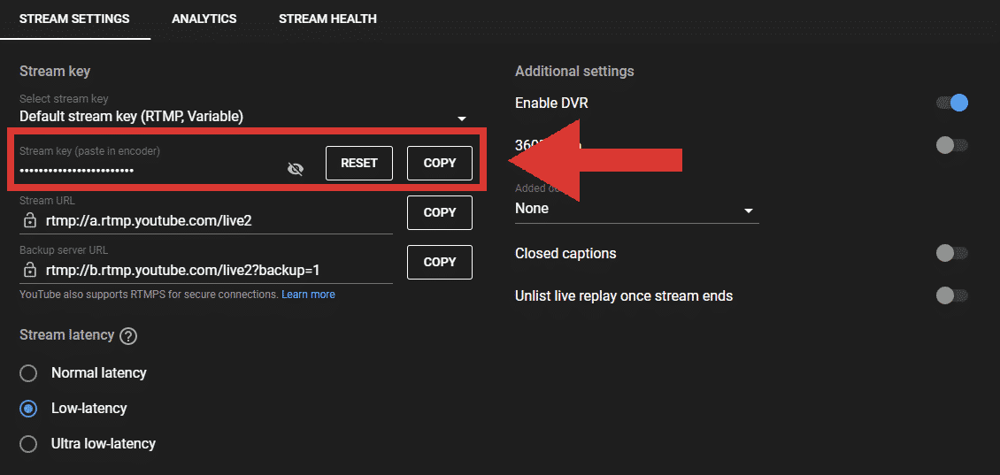

## Introduction

First and foremost ***thank you so much*** for giving your time to do this! You may be working behind the scenes, but your work does not go unnoticed.

This guide will help walk you through the live stream setup and operations process here at IPA. Feel free to reach out to the media director if you would like a more in-depth training as this is a condensed version of everything that goes into live stream operations. 

### Set-up

1. Start by turning on the video rack. Locate the red switches and set them to the "on" position. (The lyrics station typically turns this on, so if its already on then move onto step 2).
    
    
2. Grab iPad and walk Downstairs to turn on cameras.
3. Turn on Camera 1(Main Camera - Located on Back Center of FLC) by flipping the on switch below.
    
    
    
4. Turn on Camera 2 (Stage View Camera - Located on Left Back of FLC) by pressing the on switch on the slider and flipping the on switch on the camera.
    
    
    
5. Setup Slider for Camera 2, on the iPad 
    
    
    Open This App
    
    

1. Turn on Camera 3 (Keys Cam  - Located on Right of Stage) by pressing the on switch on the slider and flipping the on switch on the camera.
    
    
    

    Example Images are of camera 1, but follow the same concept for the keys cam.
    
2. Turn on Camera 4 (Drum Cam  - Located on Left of Stage) by flipping the on switch below.
    
    
3. Turn on the computer. Locate the power button on the back of the Mac Mini located at the bottom of the video rack. Press the power button to turn it on.
    
    
    
4. Once the computer is powered on, switch on both the TV and the monitor. 
5. After logging in, refer to the image below and click on the icons highlighted by the red box on the task bar. This action will initiate the launch of ATEM and Web Presenter.
    
6. Open YouTube by pushing on the Youtube Button on Stream Deck.
    
    
7. Create the live event for today. Make sure to copy the stream key specific to Black Magic Web Presenter.
    
    
    Click on “Go Live”
    
    
    Click on Schedule Stream
    
    
    Click on Reuse Settings
    
    
    Change the Date to reflect today’s date, and click next. Stream key will be provided on the last screen.
    
    
    Copy Stream Key
    
8. Go to Web Presenter Setup, and click on the config button. 
    
    
    Paste the Stream Key into the Key Field and Press Save
    
9. Switch on all the cameras and ensure the Foldback TV on stage is turned on.
10. That concludes the setup process. To ensure everything is functioning properly, click on Cam1 to Cam4 on the stream deck to switch between the cameras and verify their functionality.

## Operations

1. Turn on Sliders
2. Press PP7 and Press Cut. Wait for Lyrics person to display the countdown. The screen should look like the below, the highlighted in Red shows the countdown, and have camera 2 in preview.
    
    
3. As soon as they put up the countdown (at 10:26), go live by going to the Web Presenter Config, Pressing “On Air” and Save. 
    
    
4. As soon as the countdown is done, press fade to switch to Camera 2. 
5. Frame the individual who’s doing the intro on Camera 1, and switch to Camera 1 by pressing cut.
    
    Example of what it should look like
    
6. Around the time the intro ends, go back to camera 2, and frame camera 1 to whoever is leading the first song. 
    
    Example of what it should look like
    
7. Press On Air Button (twice) to display lyrics on live stream as soon as worship starts. 
8. Switch between cameras, follow the beat, and be natural. Imagine if you were watching live stream, and what you would like to see to build an environment of worship. 
9. When worship ends, double press the on air button to remove the lyrics off the screen. 
10. Once Pastor or other Speaker takes stage, change to camera 2 to get wide shot, and use the next 30 to 50 seconds to adjust camera 1 on the speaker. 
    
    Example of what it should look like
    
11. Make sure you’re paying attention, as some speakers like to move around a lot, others stay stationary. Feel free to switch to camera 2 and camera 3 to get a good audience view to make the online viewers feel like they’re joining in person. 
12. As the lyrics person displays slides, make sure you’re displaying them aswell by pressing the PP7 button and cutting into the lyrics and back out to the video. Try not to show the slides for more than 30 seconds to a minute. 
13. Once the sermon is done, we’ll go to the last song where you’ll follow the same instructions as we did for worship time. 
14. Once the song is done, reposition Camera 1 to Pastor or whoever is doing the ending prayer. 
15. After the ending prayer, the admin director will come up to do announcements, make sure you’re showing the slides using the PP7 button, and switching back and forth to video and slides just like the sermon. 
16. To end the stream, wait for the lyrics person to display the outro video. Press PP7 and Cut to put it on the stream. 
17. Wait about 1 minute, then go back into the BlackMagic Web Presenter HD Options.  Select off for live steam and press save. 
    
    
18. That’s it! You’re done for today, follow the shutdown instructions to shut everything down properly, and make sure your station is cleaned up and ready for the next person. 

## Shut Down

1. Begin by closing all open programs and shutting down the computer gracefully.
    
    
2. Ensure that all cameras are turned off, and don't forget to switch off the sliders.
3. Proceed to turn off the Foldback Screen, also known as the Stage Screen.
4. Lastly, power down the video rack by first switching off the button and then the top.