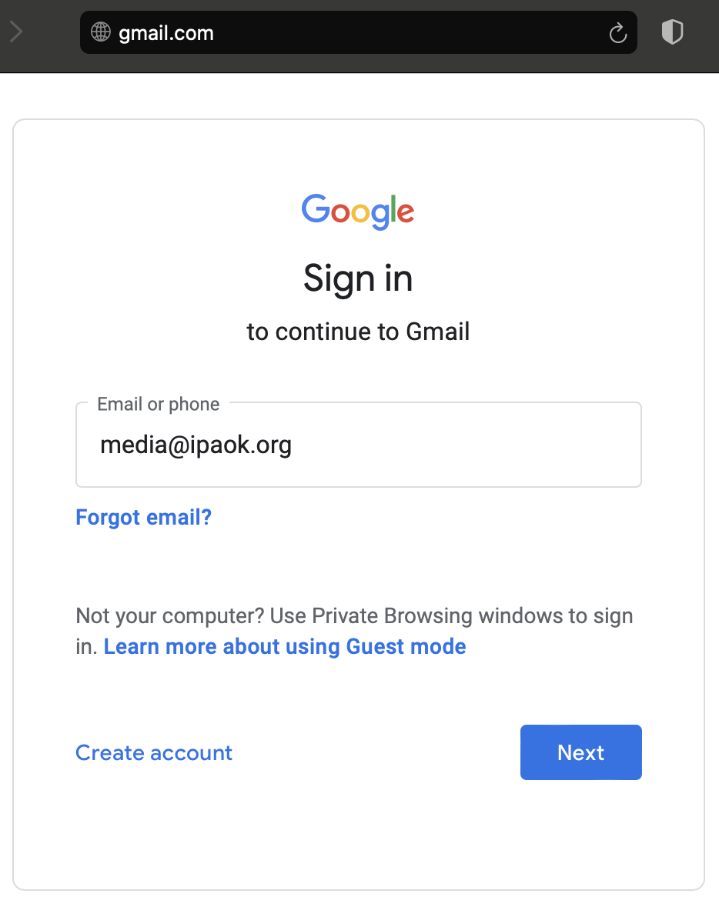
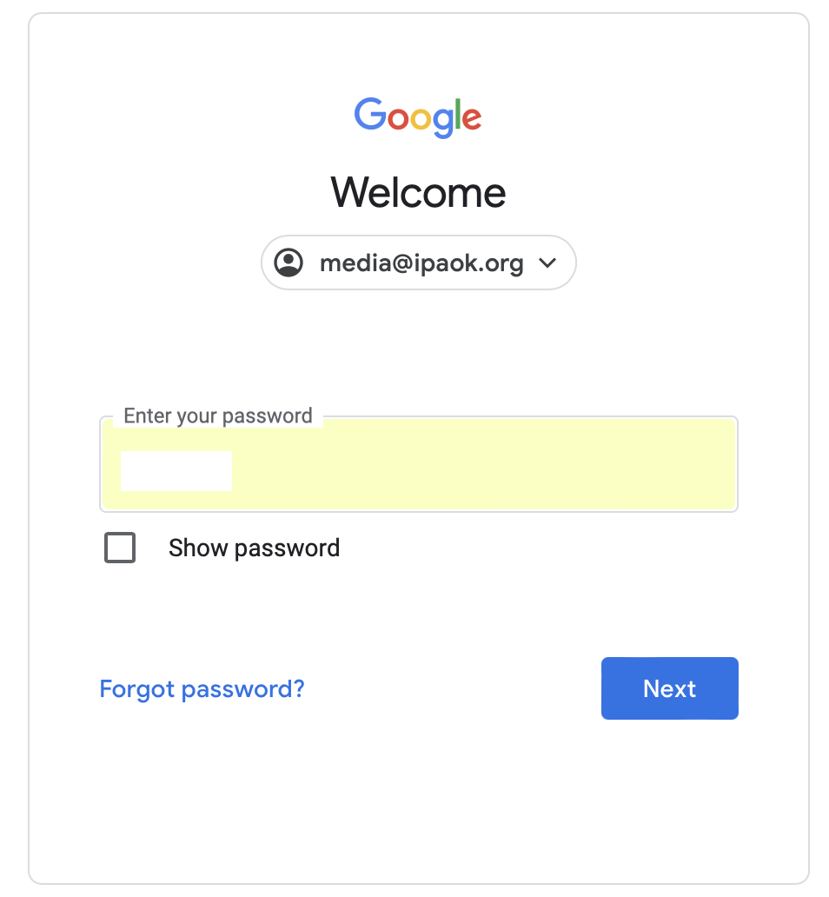
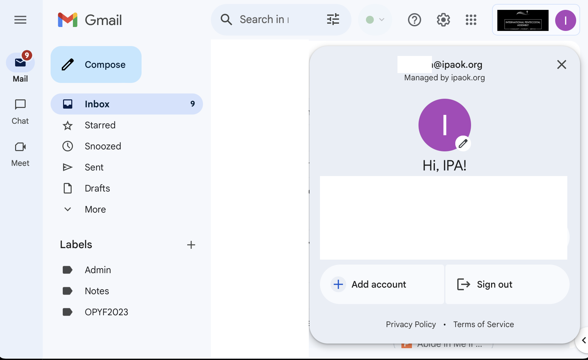
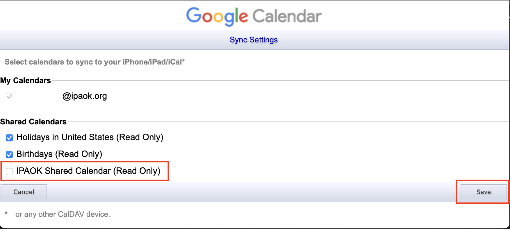

# IPA Email Docs

## Logging in

1. **Open Your Web Browser:**
    - Launch your preferred web browser
    - In the address bar, type the URL for the Google login page: [https://gmail.com](http://gmail.com) or https://mail.google.com/.
2. **Enter Your Email Address and password:**
    - On the login page, enter your full IPAOK email address (boardposition@ipaok.org). This is the email address should have already been provided to you.
        

    - Click on "Next"
    - Enter the password associated with your IPAOK email address. Be cautious with the case-sensitive nature of passwords.
        
        
    - Any issues with this step, please email techdirector@ipaok.org
3. **Click on "Next" or "Sign In":**
    - After entering your credentials, click on the "Next" or "Sign In" button to proceed.
4. **Explore Your Google Workspace Dashboard or Gmail Inbox:**
    - Once logged in, you'll be directed to your Gmail inbox. Familiarize yourself with the available applications and features.
        

## Enabling Shared Calendar on iOS Calendar

> **Issue**: I can see the IPA Shared Calendar on the computer but it does not show up on my iPhone.

1. **Access Google Calendar Sync Settings**: Open the Safari web browser on your iOS device (iPhone or iPad) and navigate to the following URL: https://calendar.google.com/calendar/syncselect
2. **Sign in to Your Google Account**: If prompted, sign in to your IPA account using your email address and password.
3. **Select the Shared Calendar**: On the "Sync Settings" page, you'll see a list of all the calendars associated with your Google account. Scroll through the list to find the shared calendar (usually named something like "IPAOK Shared Calendar").
    
    
4. **Enable Sync for the Shared Calendar**: Toggle the check next to the IPAOK Shared Calendar and press save to enable synchronization for that calendar.
5. **Open the Calendar App on Your iOS Device**: Once you've saved the changes, exit the browser and open the built-in Calendar app on your iOS device.
6. **Verify Sync**: In the Calendar app, navigate to the "Calendars" section to view a list of all synced calendars. You should see the shared calendar (e.g., "IPAOK Shared Calendar") listed there. Make sure the checkbox next to the shared calendar is checked to display its events in the Calendar app.
7. **View Shared Calendar Events**: After verifying the sync, you can now view events from the shared calendar alongside your personal calendars in the iOS Calendar app.