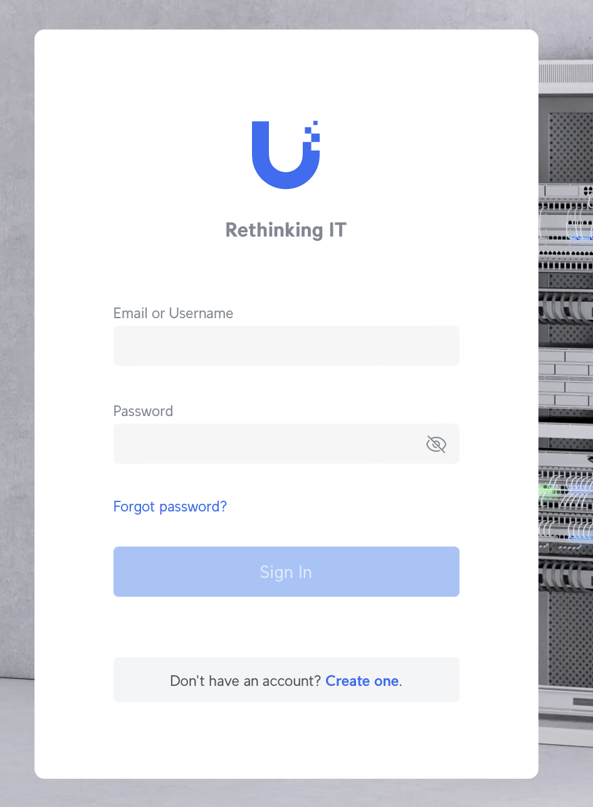

# Networking Guide 

We rely on Ubiquiti UniFi networking gear to meet all our networking needs. This robust and scalable system allows us to manage our network with ease, providing reliable Wi-Fi and internet connectivity throughout our facilities. UniFi's advanced features enable us to optimize performance, maintain security, and support the various technology systems that power our worship services and day-to-day operations. By using UniFi, we ensure that our network infrastructure is both efficient and adaptable to our growing needs.

## Definitions

### Subnet

Subnets (short for "subnetworks") are subdivisions of a larger network. They are used to partition a network into smaller, manageable segments. This helps improve network performance, security, and organization.

#### **Key Points about Subnets:**

- **IP Address Range:** Each subnet has a range of IP addresses. Devices within the same subnet can communicate directly with each other.
- **Subnet Mask:** A subnet mask defines the boundary of the subnet and separates the network portion of the IP address from the host portion.
- **Purpose:** Subnets help in efficiently managing IP addresses, reducing broadcast traffic, and improving security by isolating different network segments.

For example, in a home network, you might use subnets to separate devices for different purposes, such as guest devices and home devices, each with its own range of IP addresses.

### VLAN

A VLAN (Virtual Local Area Network) is a logical grouping of devices on a network, regardless of their physical location. It allows you to segment a network into multiple, isolated networks to improve security and reduce broadcast traffic.

#### **Key Points about VLANs:**

- **Logical Segmentation:** VLANs enable you to create distinct broadcast domains within a physical network. Devices in different VLANs cannot directly communicate with each other unless routing is configured.
- **Improved Security:** By isolating sensitive data or departments into separate VLANs, you can control access and reduce the risk of unauthorized access.
- **Flexible Management:** VLANs make it easier to manage and reorganize network segments without changing physical wiring.
- Improved Availability: VLANs can make it easy for us to set rules for specific departments or networks so we make sure network traffic is prioritized appropriately.

For example, in a company, you might create separate VLANs for different departments (e.g., HR, IT, and Sales) to keep their traffic separate and secure.

### LAN

A LAN (Local Area Network) is a network that connects devices within a limited geographic area, such as a home, office, or school. It allows these devices to communicate with each other and share resources like files, printers, and internet connections.

#### **Key Points about LANs:**

- **Scope:** LANs typically cover a small area, such as a single building or a campus.
- **High Speed:** LANs usually offer high-speed data transfer rates and low latency.
- **Private Network:** LANs are usually private networks, meaning they are not directly accessible from the outside world without additional security measures.

For example, a home LAN might connect computers, smartphones, and printers within a household, allowing them to share internet access and files.

### WAN

A WAN (Wide Area Network) is a network that spans a large geographic area, often connecting multiple LANs (Local Area Networks) over long distances, such as across cities, countries, or even continents.

#### **Key Points about WANs:**

- **Scope:** WANs cover broad areas, connecting different locations that can be far apart.
- **Connectivity:** They use various technologies to connect disparate networks, including leased lines, satellite links, and public internet.
- **Purpose:** WANs enable communication and resource sharing between geographically dispersed offices or networks.

For example, a company with offices in multiple cities might use a WAN to connect these locations, allowing employees to share files, access central databases, and communicate effectively across long distances.

### Firewall

A firewall is a security device or software that monitors and controls incoming and outgoing network traffic based on predetermined security rules. It acts as a barrier between a trusted internal network and untrusted external networks, such as the internet, to prevent unauthorized access and threats.

#### **Key Points about Firewalls:**

- **Function:** Firewalls inspect data packets traveling between networks and either allow or block them based on defined security rules.
- **Types:** They can be hardware-based, software-based, or a combination of both.

#### **Firewall Rules:**

- **Definition:** Firewall rules are specific instructions that dictate how the firewall should handle traffic. These rules define which types of traffic are allowed or denied based on criteria such as IP addresses, port numbers, and protocols.
- **Rule Types:**
    - **Allow Rules:** Specify which traffic should be permitted through the firewall.
    - **Deny Rules:** Specify which traffic should be blocked or rejected.

For example, a firewall rule might allow web traffic (HTTP/HTTPS) from the internet to reach a company’s web server while blocking all other types of traffic to that server.

## UniFi General Overview

### VLANS

- **Default**: Unused, this is there as a break glass.  Nobody should connect to this ever.
- **IPA Guest**: General Access for all guests and members. Speed on this network is restricted to 100/5.
- **IPA IoT**: Used for Thermostats and other IoT devices. Speed on this network is restricted to 100/5.
- **IPA Media**: Used for Media Team on devices owned by IPA. This VLAN can connect to other VLANs and has no speed restrictions so access to this is restricted.

### Subnets

- **Default** (Unused, this is there as a breakglass. Nobody should ever use this)
    - **Subnet**: 192.168.1.0/24
    - **Available** **Hosts**: 254
- **IPA Guest**:
    - **Subnet**: 192.168.4.0/24
    - **Available Hosts**: 254
- **IPA IoT**:
    - **Subnet**: 192.168.2.0/24
    - **Available Hosts**: 254
- **IPA Media**:
    - **Subnet**: 192.168.3.0/24
    - **Available Hosts**: 254

### WiFi Networks

- **IPA-Guest**
    - General Access for all guests and members. Speed on this network is restricted to 100/5.
- **IPA-IoT**
    - Used for Thermostats and other IoT devices. Speed on this network is restricted to 100/5.
- **IPA-Media**
    - Used for Media Team on devices owned by IPA. This VLAN can connect to other VLANs and has no speed restrictions. Access to this WiFi Network is restricted. New Access should and must be approved by media director.

### FAQs

- Why is speed on the Guest Network and IoT limited to 100/5?
    - To ensure our live stream is prioritized and maintains optimal quality, we limit the speed on the Guest Network and IoT devices. Our total available bandwidth is 300/30, and we reserve 15-20 Mbps upload speed specifically for the live stream. This prevents disruptions caused by random devices uploading large amounts of data, which have previously caused our live stream to go offline.
- Why are we using a /24 rather than a /23 or lower?
    - We do not expect or desire more than 254 devices to connect to our network simultaneously. Considering our limited outbound internet capacity, keeping the number of connected devices at 254 or fewer ensures that everyone can access the internet effectively.

    | Network Bits | Subnet Mask     | Bits Borrowed | Subnets | Hosts/Subnet |
    |--------------|-----------------|---------------|---------|--------------|
    | 16           | 255.255.0.0     | 0             | 0       | 65534        |
    | 17           | 255.255.128.0   | 1             | 2       | 32766        |
    | 18           | 255.255.192.0   | 2             | 4       | 16382        |
    | 19           | 255.255.224.0   | 3             | 8       | 8190         |
    | 20           | 255.255.240.0   | 4             | 16      | 4094         |
    | 21           | 255.255.248.0   | 5             | 32      | 2046         |
    | 22           | 255.255.252.0   | 6             | 64      | 1022         |
    | 23           | 255.255.254.0   | 7             | 128     | 510          |
    | 24           | 255.255.255.0   | 8             | 256     | 254          |
    | 25           | 255.255.255.128 | 9             | 512     | 126          |
    | 26           | 255.255.255.192 | 10            | 1024    | 62           |
    | 27           | 255.255.255.224 | 11            | 2048    | 30           |
    | 28           | 255.255.255.240 | 12            | 4096    | 14           |
    | 29           | 255.255.255.248 | 13            | 8192    | 6            |
    | 30           | 255.255.255.252 | 14            | 16384   | 2            |

## Accessing the UnFi Portal

1. Browse to [https://unifi.ui.com](https://unifi.ui.com/)
        
2. Login using your username and password. Click on IPA
        
3. You’re on the dashboard
    