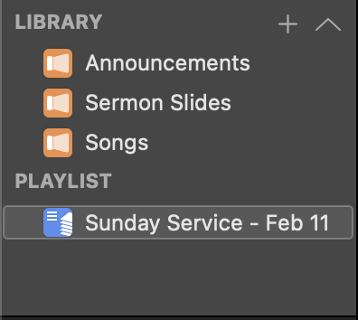

## Introduction

First and foremost ***thank you so much*** for giving your time to do this! You may be working behind the scenes, but your work does not go unnoticed.

This guide will be a condensed version of ProPresenter’s official guide and include some notes that specifically apply to running graphics at IPA. 

## **Pre-Startup Checklist**

-   Press the button on the UPS (it's behind the computer screen).
    
    
- Grab the remote seen in the image below to turn on the projector and aim it at the receiver.
    
    
- Switch on both red power switches on the Livestream Rack.
    
    
- Switch on TV on the right of the computer using the Vizio Remote.
    
    
- Switch on small monitor on the left of the computer by pressing the power button.
    
    
- Turn on the TV by the **stage** (Confidence Monitor/Foldback Screen) by switching on the black power strip on the floor.
    
    
- Power on Mac Studio Computer. Button is located on the back of the monitor. 

## Startup & Setup:

1. Follow Pre-Startup Checklist to ensure all screens are on before turning on the computer. 
2. Log in with the password ____________________.
3. Open ProPresenter (PP7).
    
    
4. On the Library panel  (located on the left side of the window) select Sunday Services, click the + button and select “Planning Center Service…”
    
    
    
5. Expand the “Sunday Combined Service” dropdown and select this week’s schedule. For our example it will be February 18, 2024 as seen in the image below.  Click on select to open up the schedule. 
    

6. The program will look like the image below. Make sure your order of service matches what's on your Planning Center account. if it does not, right click on the Sunday Service playlist and click refresh.
    
    
7. Drag the Countdown Slides into the countdown spot.
    
    
    
8. Drag the Master Slides into the Intro spot, selecting "Welcome."
    
    
    
    
9. Drag each song into its designated spot. If a song isn't there, you can add it from CCLI SongSelect.
    
    
10. Add backgrounds to each song, making sure they match the tempo.
11. Log into the media email, and download Pastor’s Sermon.
    
    
12. Add the Sermon Slides from the Pastor's email, including an Intro slide.
    1. On ProPresenter go to File > Import > Powerpoint…
        
        
    2. Select your file and Press Import.
        
        
    3. On the Library Selection Window, Select Sermon slides in the dropdown and press Ok. 
        
        
    4. Go back to your playlist, and add the sermon slides into today’s playlist. 
        
        
13. Add the Kids dismissal slide, located in presentations. 
14. Add the Announcements Slides from Canva by either clicking the link below or clicking on the desktop icon 
    
    
15. Download Announcements Slides
    
    
    
16. Go to Announcements Master.
    
    
17. Delete all slides except for the first slide. 
    
    
    
18. Drag this week’s announcements into the announcements master in Pro Presenter. (All Slides except for the first side, since we did not delete it).
    
    
    
19. Set up Actions (Triggers) for songs:
    - Start a countdown for the first song with a timer of 20 minutes, allowing overrun.
        
        
        
    - Set stage view for worship. Ensure the Foldback and Multiview is set to “Worship_IPA”.
        
        
20. Click on the first slide of each and every song and set up Audience Look for Songs.
    
    
21. Set up Audience Look for Sermon
    
    
22. Set up Audience Look for Announcements
    
    
23. Set up Triggers for the Sermon:
    - Set a timer for 30 minutes, allowing overrun.
        
        Click on “Time Left”
        
        
        Set Timer to 30 Minutes
        
    - Trigger an audience look and stage setup for the sermon presentation.
        
        
        Ensure Presentation IPA is selected for both stage layouts.
        
    - Change the theme from, **IPA Worship** to **IPA Sermon Slides.**
        
        

## Operations

- When you come in turn on lights #2 and #3. Lights #1 and #4 will remain off throughout the service.
    
- Open up church mix songs playlist on Spotify, and have it ready to play.
- Start the music on Spotify at 10:20 am.
- Kick off the countdown at 10:26 am.
- When the countdown hits 4:00, smoothly lower the Spotify volume as the countdown video takes over.
- When the countdown hits 30 seconds, turn off the house lights # 2 and #3.
    
- After the countdown, welcome everyone with the welcome graphic until the worship team takes the stage.
- When the worship leads starts to speak or song display the first song (blank) slide to start the "Worship ends in" countdown.
- During worship, keep an eye on the lyrics and switch slides as needed.
- When worship wraps up, the Pastor will speak and welcome. Turn on lights #2 and #3 as soon as he starts the welcome.
    
- When he’s wrapping up with the welcome, and before the sermon starts, display the "Children's Church Dismissed" slide.
- Display Sermon slides sent by the speaker, if they’re just asking for bible references, display those on ProPresenter.
- Once the sermon finishes, switch to a blank slide as the worship leader begins again.
- Stay on the blank slide for the Pastor's closing prayer.
- After that, it's announcement time! When Jimmy (or whoever's up) starts, show the first announcement slide and cue up the Spotify church mix (still muted).
- Roll through the announcements, when Jimmy (or whoever else) walks off stage, end it off with the outro video, gradually turning up the Spotify volume.
- That's the rundown for the Graphics/Lyrics volunteer. Thank you so much for serving today!

## To shut everything down:

1. Close ProPresenter (PP7) on the Mac Studio.
2. Turn off all displays:
    - Turn off the TV by pressing its power button.
    - Use the remote to turn off the projector.
    - Switch off both red buttons on the Livestream Rack.
3. Turn off the Mac Studio computer.
4. Long-press the button on the UPS (located behind the computer screen) until you hear beeping.
5. Clean up the desk and throw away all trash.

## FAQs

- What’s a Library and a Playlist?
    
    
    - The "Library" is a section where you store and organize all your media files, such as slides, images, videos, and audio files. It acts as a central repository for all your presentation assets.
    - A "playlist" in ProPresenter is a collection of media items that are arranged in a specific order for the Sunday Service. Playlists can include slides, videos, songs, or any other type of media supported by ProPresenter. They provide a structured way to organize and present content during Sunday Services.